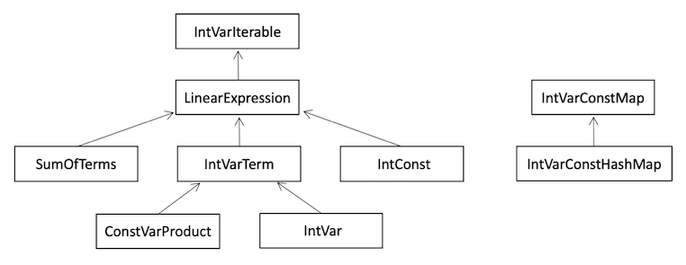

# Aufgabenblatt 5

## Allgemeine Anmerkungen

Ihre Lösung für dieses Aufgabenblatt ist bis Freitag, 17.5. 11h durch `git commit` und `push`
abzugeben. Sie erhalten Feedback am 23.5., Nachbesserungen sind bis 27.5., 11h möglich. Mit 
der Angabe werden folgende Dateien mitgeliefert:
[IntConst](../src/AB5/IntConst.java), [IntVar](../src/AB5/IntVar.java),
[IntVarQueue](../src/AB5/IntVarQueue.java),
[IntVarConstMap](../src/AB5/IntVarConstMap.java),
[IntVarConstHashMap](../src/AB5/IntVarConstHashMap.java),
[IntVarIterable](../src/AB5/IntVarIterable.java),
[IntVarIterator](../src/AB5/IntVarIterator.java),
[LinearExpression](../src/AB5/LinearExpression.java),
[IntVarTerm](../src/AB5/IntVarTerm.java),
[ConstVarProduct](../src/AB5/ConstVarProduct.java),
[SumOfTerms](../src/AB5/SumOfTerms.java)
und [Test](../src/AB5/Test.java).
Vorgegebene Programmteile dürfen nur an den Stellen verändert werden, die mit TODO markiert sind.
Zusätzliche Klassen, Interfaces, Methoden und Variablen dürfen eingefügt werden. Definieren Sie 
keine geschachtelten oder (anonymen) inneren Klassen, also keine Klassen, die in einer anderen
Klasse, einem Objekt oder einer Methode stehen. Wenn Sie zusätzlich zu den gefragten
Klassen weitere Klassen definieren, achten Sie darauf, dass die Klassen im
Unterverzeichnis [AB5Muster](../src/AB5) erstellt werden und als erste Zeile die Deklaration
`package AB5Muster;` enthalten, um Konflikte mit späteren Aufgabenblättern zu vermeiden.
Implementieren Sie keine unnötigen Getter-/Setter-Methoden.

## Ziel

Ziel der Aufgabe ist die Anwendung der Konzepte: Interfaces, dynamisches Binden,
Implementierung von toString(), Gleichheit und Hash-Werte, Hash-Tabelle (siehe Skriptum Seite
75-91).

## Beschreibung der gegebenen Dateien

- [LinearExpression](../src/AB5/LinearExpression.java) ist ein Interface für Klassen die 
  (mathematische) lineare Ausdrücke repräsentieren. Ein linearer Ausdruck ist z.B. `3x-2y+2`, 
  wobei `x` und `y` freie Variablen in diesem Ausdruck sind. Weist man einer Variable in diesem 
  Ausdruck einen fixen Wert zu, entsteht ein anderer Ausdruck. Weist man in diesem Beispiel der 
  Variable `x` den Wert `3` zu, entsteht der neue Ausdruck `-2y+11`.
- [IntConst](../src/AB5/IntConst.java) ist die fast vollständig vorgegebene Implementierung einer
  Klasse, die ganzzahlige Konstanten repräsentiert.
- [IntVar](../src/AB5/IntVar.java) ist das Gerüst für eine Implementierung einer
  Klasse, die (mathematische, freie) Variablen repräsentiert, deren Domäne ganze Zahlen sind.
- [IntVarQueue](../src/AB5/IntVarQueue.java) ist die vollständige Definition einer Klasse für 
  Queues mit Elementen vom Typ `IntVar`.
- [IntVarConstMap](../src/AB5/IntVarConstMap.java) ist ein vollständig gegebenes Interfaces
  für assoziative Datenstrukturen, die Schlüssel vom Typ `IntVar` mit Werten vom Typ `IntConst` 
  assoziieren.
- [IntVarConstHashMap](../src/AB5/IntVarConstHashMap.java) ist das Gerüst für eine
  Hash-Tabelle, die [IntVarConstMap](../src/AB5/IntVarConstMap.java) implementiert.
- [IntVarIterable](../src/AB5/IntVarIterable.java) ist ein vollständig vorgegebenes Interface für
  iterierbare Objekte mit Elementen vom Typ `IntVar`. `LinearExpression` erweitert dieses Interface.
- [IntVarIterator](../src/AB5/IntVarIterator.java) ist ein vollständig vorgegebenes Interface 
  für einen Iterator über Elemente vom Type `IntVar`.
- [IntVarTerm](../src/AB5/IntVarTerm.java) ist das vorgegebene Interface für spezielle Ausdrücke,
  nämlich solche, die nur aus einem linearen Term, wie zum Beispiel `3x`, mit einem Koeffizienten 
  und einer Variable bestehen. Dieses Interface wird von [IntVar](../src/AB5/IntVar.java) 
  und [ConstVarProduct](../src/AB5/ConstVarProduct.java) implementiert. 
- [ConstVarProduct](../src/AB5/ConstVarProduct.java) ist das Gerüst einer Klasse, die 
  [IntVarTerm](../src/AB5/IntVarTerm.java) implementiert. 
- [SumOfTerms](../src/AB5/SumOfTerms.java) ist das Gerüst für eine Klasse, die Summen mit mindestes
  zwei Summanden repräsentiert, wie zum Beispiel `3x-y` oder `x+y+5`. Diese Klasse implementiert
  [LinearExpression](../src/AB5/LinearExpression.java). Zusammengefasst lassen sich die
  Untertypbeziehungen wie folgt darstellen:

  
- [Test](../src/AB5/Test.java) ist eine vorgegebene Klasse, die Sie zum Testen Ihrer
  Implementierung verwenden sollten. Bei einer fehlerfreien Implementierung sollten bei der  
  Ausführung dieser Klasse keine Ausnahmen (Exception) ausgelöst werden und alle Tests als
  erfolgreich ("successful") ausgegeben werden. Sie müssen diese Klasse nicht verändern, können
  aber eigene Testfälle hinzufügen.

## Aufgaben
Ihre Aufgaben sind folgende:
1. Aktivieren Sie die Implementierung der Methode `plus(IntVarTerm)` in der 
   Klasse [IntConst](../src/AB5/IntConst.java). Aktivieren Sie die Spezifikationen 
   und vorgegebenen default-Implementierungen im Interface [IntVarTerm](../src/AB5/IntVarTerm.java).
   Lesen Sie den vorgegebenen Programmcode von [IntConst](../src/AB5/IntConst.java) und
   [IntVarTerm](../src/AB5/IntVarTerm.java), insbesondere die default-Implementierungen
   der `plus`-Methoden, um Hinweise für die Implementierungen der anderen Klassen zu finden.
2. Vervollständigen Sie die Klassendefinitionen von [IntVar](../src/AB5/IntVar.java) und  
   [IntVarConstHashMap](../src/AB5/IntVarConstHashMap.java) gemäß der Kommentare in den Dateien.
3. Vervollständigen Sie die Klassendefinitionen von 
   [ConstVarProduct](../src/AB5/ConstVarProduct.java) und [SumOfTerms](../src/AB5/SumOfTerms.java) 
   gemäß der Kommentare in den Dateien.

Benutzen Sie keine vorgefertigten Klassen aus dem Java-Collection-Framework!

### Denkanstöße (ohne Bewertung)
1. Welche Vor- und Nachteile haben die zusätzlichen Spezifikationen von 
   `plus(IntConst)`, `plus(IntVarTerm)`, die ja eigentlich von `plus(LinearExpression)` abgedeckt 
   sind?
2. Welche Alternativen gibt es für die Implementierung von [SumOfTerms](../src/AB5/SumOfTerms.java)?

#### _Punkteaufteilung_
- Implementierung von [IntVar](../src/AB5/IntVar.java): 1.5 Punkte
- Implementierung von [IntVarConstHashMap](../src/AB5/IntVarConstHashMap.java): 2 Punkte
- Implementierung von [ConstVarProduct](../src/AB5/ConstVarProduct.java): 1.5 Punkte
- Implementierung von [SumOfTerms](../src/AB5/SumOfTerms.java): 3 Punkte
- Gesamt: 8 Punkte

